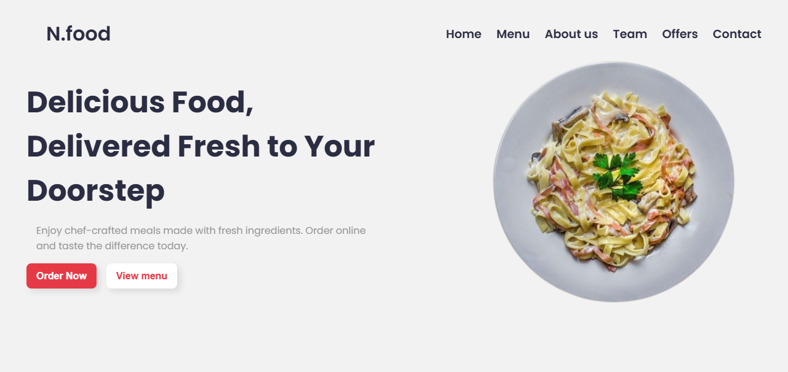

# 🌍 Responsive Restaurant Website - N.food

A fully responsive **Restaurant & Food Delivery** website built with **HTML5, CSS3, and JavaScript**.
This project showcases a modern, clean UI with animations and responsive design for desktop, tablet, and mobile devices.

## ✨ Features

- 📱 **Fully Responsive Design* (Desktop, Tablet, Mobile)
- 🎨 **Modern UI/UX with custom color palette**
- 📂 **Reusable Components** (cards, buttons, filter sections)
- 🌟 **Scroll Animations** using [ScrollReveal](https://scrollrevealjs.org/)
- 🍔 **Responsive Navbar with Hamburger menu**
- 🍕 **Interactive Menu Filter by category**
- 🎯 **Multiple Sections:** Home, Menu, About, Team, Offers, Contact
- ⚡ **Smooth Animations and hover effects**

## 🖼️ Demo

🔗 [Live Demo](https://zahra-babamohammadi.github.io/Restaurant-website/)  

## 🚀 Technologies Used
- **HTML5** – Semantic structure
- **CSS3** – Flexbox, Grid, CSS Variables, Animations, Media Queries
- **JavaScript (ES6)** – DOM manipulation, scroll events, hamburger menu, filter functionality
- **ScrollReveal.js** – Animation on scroll
- **Font Awesome** – Icons
- **Google Fonts** – Poppins & Bebas Neue

## 📸 Screenshots

### Desktop View

